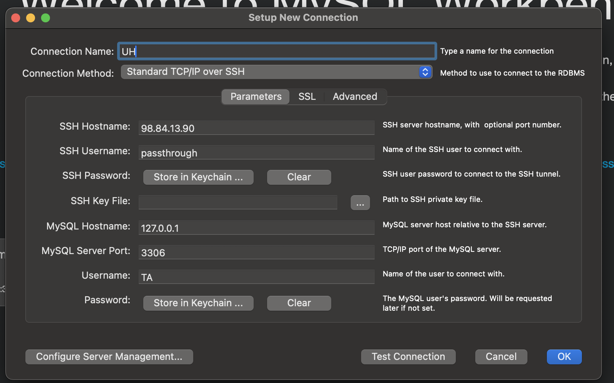

### Instructions for connecting to remote server with the mysql database

1) Need to open a SSH tunnel to the server. 

    Create a new terminal in vscode; then use this command to connect to the server as the user 'passthrough'
 
        ssh -L 3307:127.0.0.1:3306 passthrough@98.84.13.90

    When prompted, give the password:

        SwiftCheckin4SDP!

    Leave this terminal open and running until you no longer need to talk the DB (since the webapp requires the db to even start, whenver you want to run the app, you'll need to have this ssh tunnel open)

2) Confirm settings.py is set to use the database:

        'NAME': 'swiftexam',
        'USER': 'TA',
        'PASSWORD': 'SwiftExam_pass1',
        'HOST': '127.0.0.1',
        'PORT': '3307',
    
    because we are ssh'd in to the server, we can connect to the databse as if we are local even though we're on a different machine

3) In a second terminal run python manage.py runserver to launch the app as you normally would. 

    If you're making changes to styling you'll also need a third terminal with tailwind running in it. 
    
    I renamed my terminals to look like this:

    

    You may need to rmrf your migration files:

        rm LogApp/migrations/0*.py
    
    and then run makemigrate and migrate again I'm not sure. Hopefully we shouldnt have to keep doing this because the db will sync for us all because we'll all be referencing the same DB as well as the same codebase now. 

4) Finally, when you're done close the ssh tunnel by using 'exit' in the ssh terminal and ctrl+c for tailwind and django as usual

#### Notes

- The passthrough user for the server is not an admin one. Its only purpose is to allow us to tunnel to the database. 

- The TA mysql account should have full permissions to to do everything to the database except drop said database (so flush should still work).

- You can also access the database by provding the same authentication credentials to MySQLWorkbench. Change the connection method to 'Standard TCP/IP over SSH' and then provide the IP, ssh username, mysql username and the two passwords when prompted.

    Password for passthrough user: SwiftCheckin4SDP!

    Password for TA user: SwiftExam_pass1

    